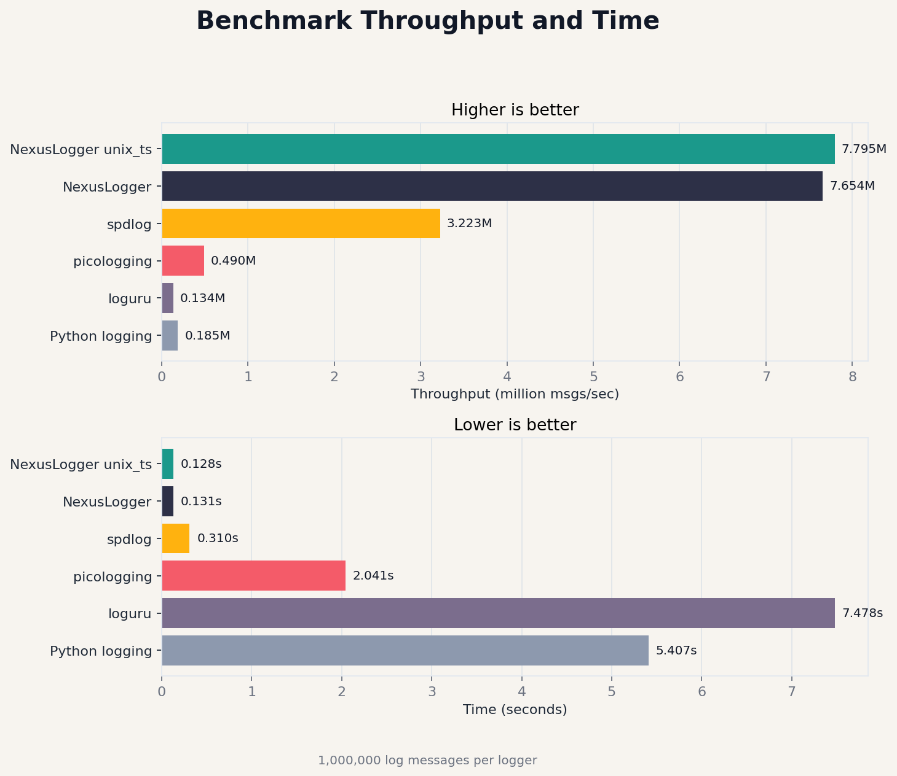

# NexusLog


High-performance async logging library, compatible with Python standard logging API.

[中文文档](README_CN.md)

## Benchmark

<p align="center">
  
</p>

```
------------------------------------------------------------
Logger               Time (s)     Msgs/sec        Log size    
------------------------------------------------------------
Python logging       5.157        193,911         81,888,890 bytes
loguru               4.612        216,826         82,888,890 bytes
picologging          1.893        528,262         78,888,882 bytes
spdlog               0.742        1,347,709       76,888,890 bytes
NexusLogger          0.135        7,407,407       97,888,890 bytes
NexusLogger unix_ts  0.130        7,692,308       82,888,890 bytes
------------------------------------------------------------

NexusLogger is 38.20x faster than Python logging
NexusLogger is 34.16x faster than loguru
NexusLogger is 14.02x faster than picologging
NexusLogger is 5.50x faster than spdlog
NexusLogger unix_ts is 39.67x faster than Python logging
NexusLogger unix_ts is 35.48x faster than loguru
NexusLogger unix_ts is 14.56x faster than picologging
NexusLogger unix_ts is 5.71x faster than spdlog
```

## Installation

```bash
pip install nexuslog
```

## Quick Start

```python
import nexuslog as logging

logging.basicConfig(level=logging.INFO)

logging.info("Hello, world!")
logging.warning("This is a warning")
logging.error("This is an error")
```

## API

### Log Levels

```python
logging.TRACE
logging.DEBUG
logging.INFO
logging.WARNING
logging.ERROR
```

### Module-level Functions

```python
logging.basicConfig(filename=None, level=logging.INFO, unix_ts=False)
logging.trace(message)
logging.debug(message)
logging.info(message)
logging.warning(message)
logging.error(message)
```

### Logger Class

```python
from nexuslog import Logger, Level

logger = Logger("myapp", path="/var/log/app", level=Level.Info)
logger.info("message")
logger.shutdown()
```

### getLogger

```python
import nexuslog as logging

logging.basicConfig(filename="/var/log/app.log", level=logging.DEBUG)
logger = logging.getLogger("myapp")
logger.info("message")
```

## License

MIT
